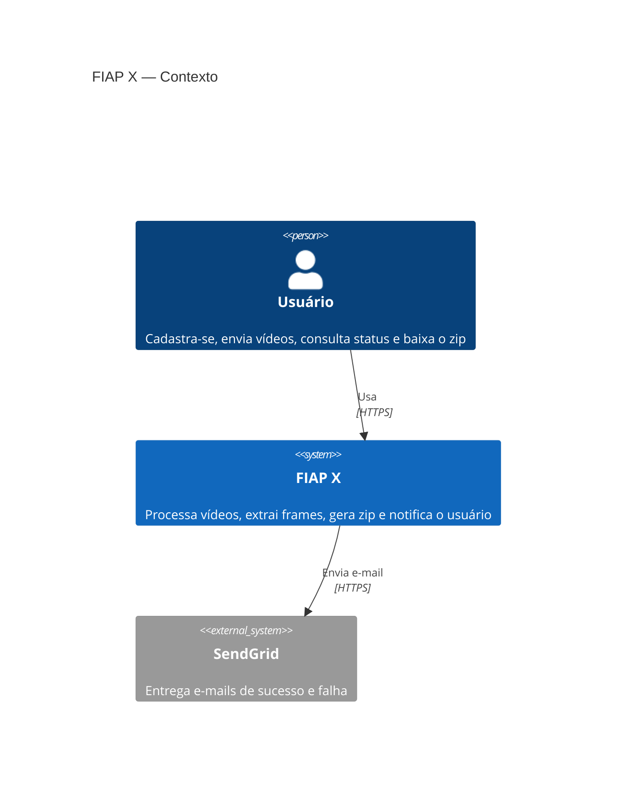

```mermaid
C4Context
  title FIAP X — Contexto

  Person(usuario, "Usuário", "Cadastra-se, envia vídeos, consulta status e baixa o zip")

  System(fiapx, "FIAP X", "Processa vídeos, extrai frames, gera zip e notifica o usuário")

  System_Ext(sendgrid, "SendGrid", "Entrega e-mails de sucesso e falha")

  Rel(usuario, fiapx, "Usa", "HTTPS")
  Rel(fiapx, sendgrid, "Envia e-mail", "HTTPS")
```
