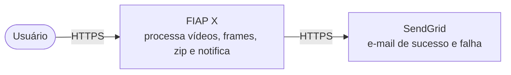

```mermaid
flowchart LR
  usuario(["Usuário"])
  fiapx["FIAP X<br/>processa vídeos, frames, zip e notifica"]
  sendgrid["SendGrid<br/>e-mail de sucesso e falha"]

  usuario -->|HTTPS| fiapx
  fiapx -->|HTTPS| sendgrid
```
