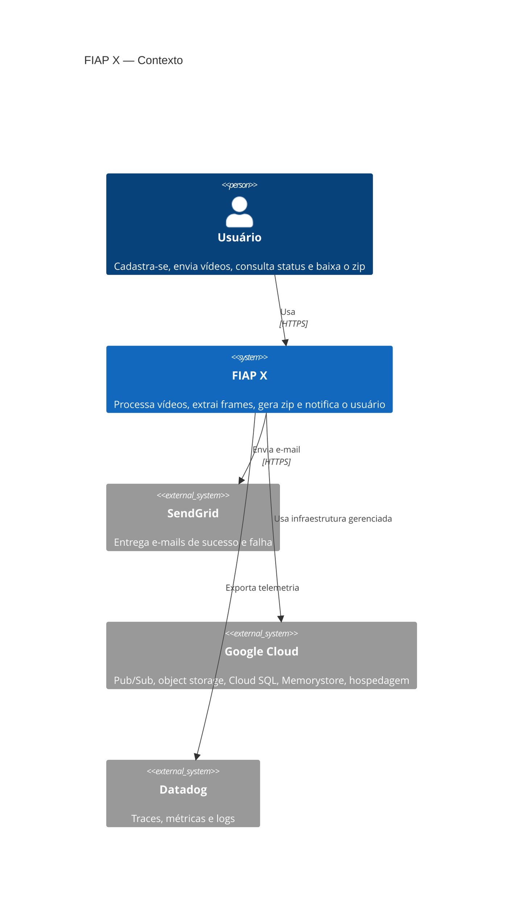

```mermaid
C4Context
  title FIAP X — Contexto

  Person(usuario, "Usuário", "Cadastra-se, envia vídeos, consulta status e baixa o zip")

  System(fiapx, "FIAP X", "Processa vídeos, extrai frames, gera zip e notifica o usuário")

  System_Ext(sendgrid, "SendGrid", "Entrega e-mails de sucesso e falha")
  System_Ext(gcp, "Google Cloud", "Pub/Sub, object storage, Cloud SQL, Memorystore, hospedagem")
  System_Ext(datadog, "Datadog", "Traces, métricas e logs")

  Rel(usuario, fiapx, "Usa", "HTTPS")
  Rel(fiapx, sendgrid, "Envia e-mail", "HTTPS")
  Rel(fiapx, gcp, "Usa infraestrutura gerenciada")
  Rel(fiapx, datadog, "Exporta telemetria")
```
