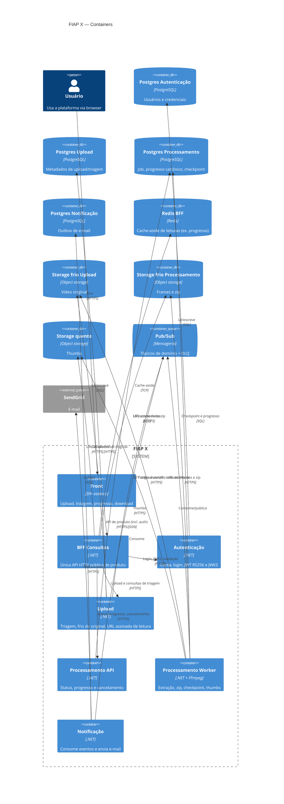

```mermaid
C4Container
  title FIAP X — Containers

  Person(usuario, "Usuário", "Usa a plataforma via browser")

  System_Boundary(fiapx, "FIAP X") {
    Container(web, "Front", "SPA estática", "Upload, listagem, progresso, download")
    Container(bff, "BFF Consultas", ".NET", "Única API HTTP pública de produto")
    Container(auth, "Autenticação", ".NET", "Conta, login, JWT RS256 e JWKS")
    Container(upload, "Upload", ".NET", "Triagem, frio do original, URL assinada de leitura")
    Container(procApi, "Processamento API", ".NET", "Status, progresso e cancelamento")
    Container(procWorker, "Processamento Worker", ".NET + FFmpeg", "Extração, zip, checkpoint, thumbs")
    Container(notif, "Notificação", ".NET", "Consome eventos e envia e-mail")
  }

  ContainerDb(pgAuth, "Postgres Autenticação", "PostgreSQL", "Usuários e credenciais")
  ContainerDb(pgUpload, "Postgres Upload", "PostgreSQL", "Metadados de upload/triagem")
  ContainerDb(pgProc, "Postgres Processamento", "PostgreSQL", "Job, progresso canônico, checkpoint")
  ContainerDb(pgNotif, "Postgres Notificação", "PostgreSQL", "Outbox de e-mail")
  ContainerDb(redis, "Redis BFF", "Redis", "Cache-aside de leituras (ex. progresso)")
  ContainerDb(frioUp, "Storage frio Upload", "Object storage", "Vídeo original")
  ContainerDb(frioProc, "Storage frio Processamento", "Object storage", "Frames e zip")
  ContainerDb(quente, "Storage quente", "Object storage", "Thumbs")
  ContainerQueue(pubsub, "Pub/Sub", "Mensageria", "Tópicos de domínio + DLQ")

  System_Ext(sendgrid, "SendGrid", "E-mail")

  Rel(usuario, web, "Usa", "HTTPS")
  Rel(web, bff, "API de produto (incl. auth)", "HTTPS/JSON")
  Rel(bff, auth, "Login, JWKS, validação", "HTTPS")
  Rel(bff, upload, "Upload e consultas de triagem", "HTTPS")
  Rel(bff, procApi, "Status, progresso, cancelamento", "HTTPS")
  Rel(bff, redis, "Cache-aside", "TCP")
  Rel(bff, frioProc, "URL assinada do zip", "HTTPS")
  Rel(bff, quente, "URL da thumb", "HTTPS")

  Rel(upload, pgUpload, "Lê/escreve", "SQL")
  Rel(upload, frioUp, "Grava/remove original", "HTTPS")
  Rel(upload, pubsub, "Publica eventos + URL de leitura")

  Rel(procApi, pgProc, "Lê/escreve status", "SQL")
  Rel(procWorker, pgProc, "Checkpoint e progresso", "SQL")
  Rel(procWorker, pubsub, "Consome/publica")
  Rel(procWorker, frioUp, "GET original via URL assinada", "HTTPS")
  Rel(procWorker, frioProc, "Frames e zip", "HTTPS")
  Rel(procWorker, quente, "Thumbs", "HTTPS")

  Rel(auth, pgAuth, "Lê/escreve", "SQL")
  Rel(notif, pgNotif, "Outbox", "SQL")
  Rel(notif, pubsub, "Consome")
  Rel(notif, sendgrid, "Envia e-mail", "HTTPS")
```
