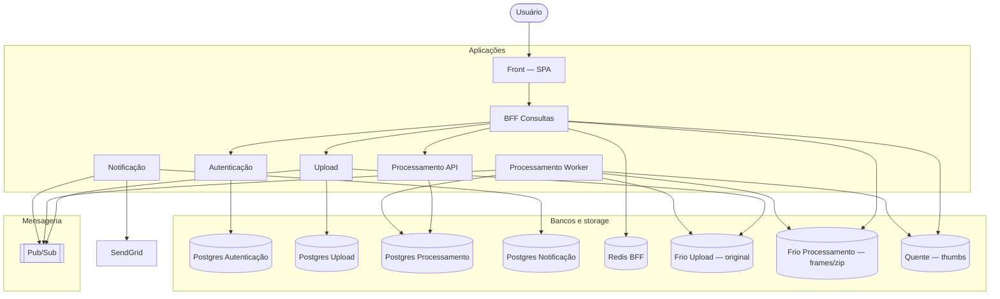

```mermaid
flowchart TB
  usuario(["Usuário"])

  subgraph apps["Aplicações"]
    direction TB
    web["Front — SPA"]
    bff["BFF Consultas"]
    auth["Autenticação"]
    upload["Upload"]
    procApi["Processamento API"]
    procWorker["Processamento Worker"]
    notif["Notificação"]
  end

  subgraph data["Bancos e storage"]
    direction TB
    pgAuth[("Postgres Autenticação")]
    pgUpload[("Postgres Upload")]
    pgProc[("Postgres Processamento")]
    pgNotif[("Postgres Notificação")]
    redis[("Redis BFF")]
    frioUp[("Frio Upload — original")]
    frioProc[("Frio Processamento — frames/zip")]
    quente[("Quente — thumbs")]
  end

  subgraph msg["Mensageria"]
    pubsub[["Pub/Sub"]]
  end

  sendgrid["SendGrid"]

  usuario --> web
  web --> bff
  bff --> auth
  bff --> upload
  bff --> procApi
  bff --> redis
  bff --> frioProc
  bff --> quente

  auth --> pgAuth
  upload --> pgUpload
  upload --> frioUp
  upload --> pubsub

  procApi --> pgProc
  procWorker --> pgProc
  procWorker --> pubsub
  procWorker --> frioUp
  procWorker --> frioProc
  procWorker --> quente

  notif --> pgNotif
  notif --> pubsub
  notif --> sendgrid
```
