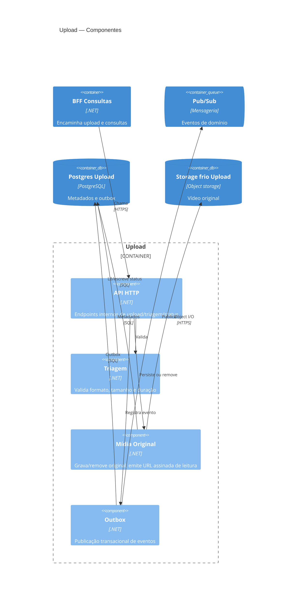

```mermaid
C4Component
  title Upload — Componentes

  Container(bff, "BFF Consultas", ".NET", "Encaminha upload e consultas")
  ContainerQueue(pubsub, "Pub/Sub", "Mensageria", "Eventos de domínio")
  ContainerDb(pgUpload, "Postgres Upload", "PostgreSQL", "Metadados e outbox")
  ContainerDb(frioUp, "Storage frio Upload", "Object storage", "Vídeo original")

  Container_Boundary(upload, "Upload") {
    Component(api, "API HTTP", ".NET", "Endpoints internos de upload/triagem/status")
    Component(triagem, "Triagem", ".NET", "Valida formato, tamanho e duração")
    Component(midia, "Mídia Original", ".NET", "Grava/remove original; emite URL assinada de leitura")
    Component(outbox, "Outbox", ".NET", "Publicação transacional de eventos")
  }

  Rel(bff, api, "Chama", "HTTPS")
  Rel(api, triagem, "Valida")
  Rel(api, midia, "Persiste ou remove")
  Rel(api, outbox, "Registra evento")
  Rel(triagem, pgUpload, "Lê/escreve status", "SQL")
  Rel(midia, frioUp, "Object I/O", "HTTPS")
  Rel(midia, pgUpload, "Metadados", "SQL")
  Rel(outbox, pgUpload, "Outbox", "SQL")
  Rel(outbox, pubsub, "Publica")
```
