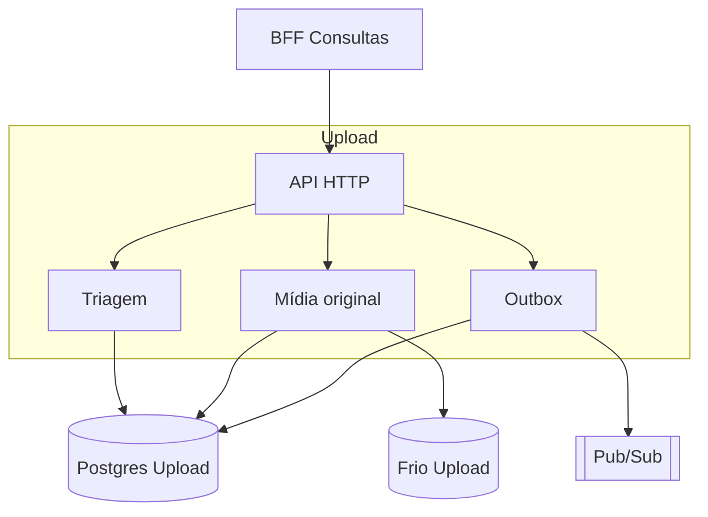

```mermaid
flowchart TB
  bff["BFF Consultas"]

  subgraph upload["Upload"]
    direction TB
    api["API HTTP"]
    triagem["Triagem"]
    midia["Mídia original"]
    outbox["Outbox"]
  end

  pgUpload[("Postgres Upload")]
  frioUp[("Frio Upload")]
  pubsub[["Pub/Sub"]]

  bff --> api
  api --> triagem
  api --> midia
  api --> outbox
  triagem --> pgUpload
  midia --> frioUp
  midia --> pgUpload
  outbox --> pgUpload
  outbox --> pubsub
```
