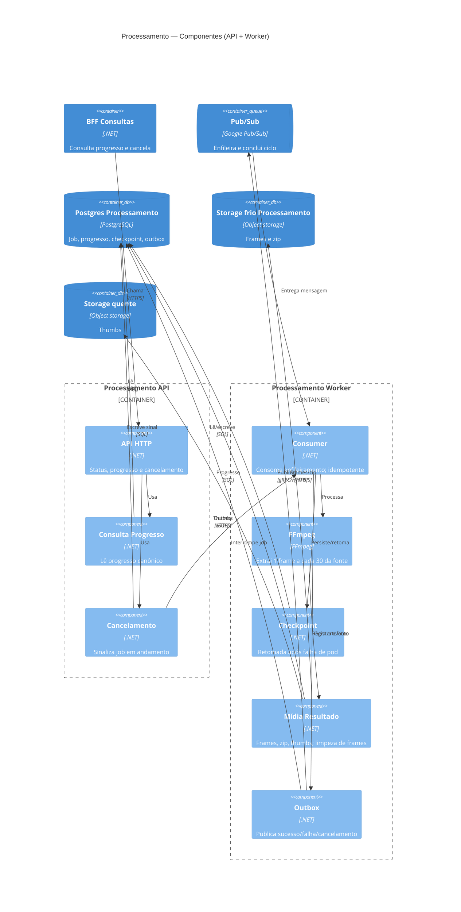

```mermaid
C4Component
  title Processamento — Componentes (API + Worker)

  Container(bff, "BFF Consultas", ".NET", "Consulta progresso e cancela")
  ContainerQueue(pubsub, "Pub/Sub", "Google Pub/Sub", "Enfileira e conclui ciclo")
  ContainerDb(pgProc, "Postgres Processamento", "PostgreSQL", "Job, progresso, checkpoint, outbox")
  ContainerDb(frioProc, "Storage frio Processamento", "Object storage", "Frames e zip")
  ContainerDb(quente, "Storage quente", "Object storage", "Thumbs")

  Container_Boundary(procApi, "Processamento API") {
    Component(apiHttp, "API HTTP", ".NET", "Status, progresso e cancelamento")
    Component(consulta, "Consulta Progresso", ".NET", "Lê progresso canônico")
    Component(cancel, "Cancelamento", ".NET", "Sinaliza job em andamento")
  }

  Container_Boundary(procWorker, "Processamento Worker") {
    Component(consumer, "Consumer", ".NET", "Consome enfileiramento; idempotente")
    Component(ffmpeg, "FFmpeg", "FFmpeg", "Extrai 1 frame a cada 30 da fonte")
    Component(checkpoint, "Checkpoint", ".NET", "Retomada após falha de pod")
    Component(midiaProc, "Mídia Resultado", ".NET", "Frames, zip, thumbs; limpeza de frames")
    Component(outboxW, "Outbox", ".NET", "Publica sucesso/falha/cancelamento")
  }

  Rel(bff, apiHttp, "Chama", "HTTPS")
  Rel(apiHttp, consulta, "Usa")
  Rel(apiHttp, cancel, "Usa")
  Rel(consulta, pgProc, "Lê", "SQL")
  Rel(cancel, pgProc, "Escreve sinal", "SQL")

  Rel(pubsub, consumer, "Entrega mensagem")
  Rel(consumer, ffmpeg, "Processa")
  Rel(consumer, checkpoint, "Persiste/retoma")
  Rel(ffmpeg, midiaProc, "Gera artefatos")
  Rel(checkpoint, pgProc, "Lê/escreve", "SQL")
  Rel(midiaProc, frioProc, "Frames/zip", "HTTPS")
  Rel(midiaProc, quente, "Thumbs", "HTTPS")
  Rel(midiaProc, pgProc, "Progresso", "SQL")
  Rel(consumer, outboxW, "Registra evento")
  Rel(outboxW, pgProc, "Outbox", "SQL")
  Rel(outboxW, pubsub, "Publica", "gRPC/HTTPS")
  Rel(cancel, consumer, "Interrompe job")
```
