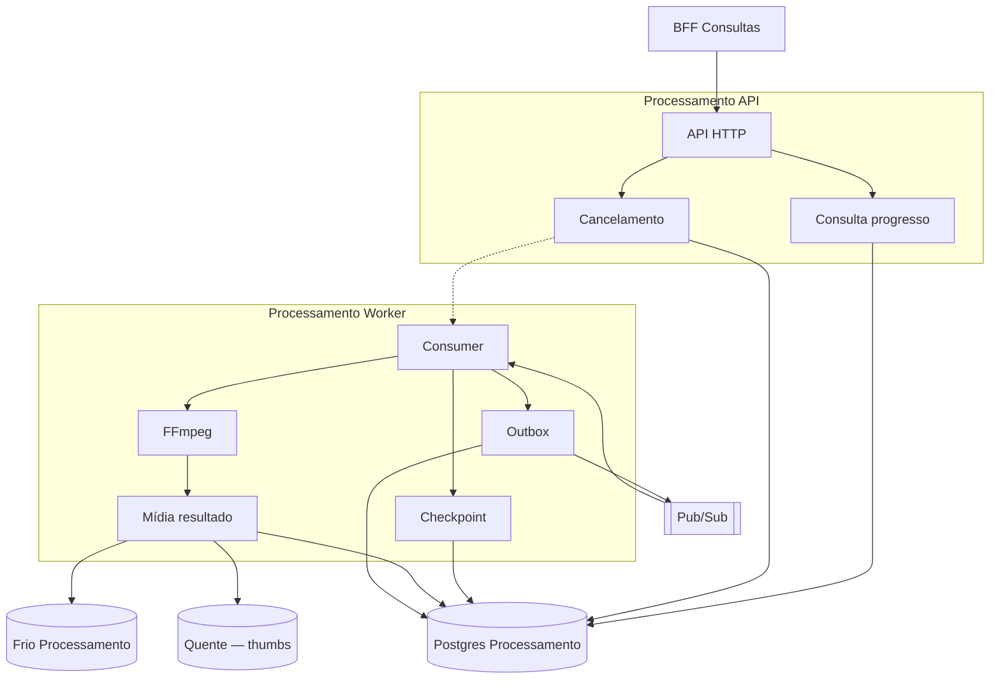

```mermaid
flowchart TB
  bff["BFF Consultas"]
  pubsub[["Pub/Sub"]]

  subgraph api["Processamento API"]
    direction TB
    apiHttp["API HTTP"]
    consulta["Consulta progresso"]
    cancel["Cancelamento"]
  end

  subgraph worker["Processamento Worker"]
    direction TB
    consumer["Consumer"]
    ffmpeg["FFmpeg"]
    checkpoint["Checkpoint"]
    midiaProc["Mídia resultado"]
    outboxW["Outbox"]
  end

  pgProc[("Postgres Processamento")]
  frioProc[("Frio Processamento")]
  quente[("Quente — thumbs")]

  bff --> apiHttp
  apiHttp --> consulta
  apiHttp --> cancel
  consulta --> pgProc
  cancel --> pgProc
  cancel -.-> consumer

  pubsub --> consumer
  consumer --> ffmpeg
  consumer --> checkpoint
  ffmpeg --> midiaProc
  checkpoint --> pgProc
  midiaProc --> frioProc
  midiaProc --> quente
  midiaProc --> pgProc
  consumer --> outboxW
  outboxW --> pgProc
  outboxW --> pubsub
```
