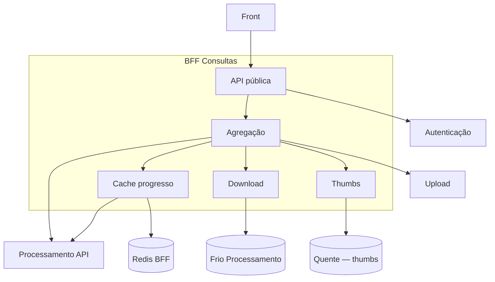

```mermaid
flowchart TB
  web["Front"]

  subgraph bff["BFF Consultas"]
    direction TB
    gateway["API pública"]
    agg["Agregação"]
    cache["Cache progresso"]
    download["Download"]
    thumbs["Thumbs"]
  end

  auth["Autenticação"]
  upload["Upload"]
  procApi["Processamento API"]
  redis[("Redis BFF")]
  frioProc[("Frio Processamento")]
  quente[("Quente — thumbs")]

  web --> gateway
  gateway --> auth
  gateway --> agg
  agg --> upload
  agg --> procApi
  agg --> cache
  cache --> redis
  cache --> procApi
  agg --> download
  download --> frioProc
  agg --> thumbs
  thumbs --> quente
```
