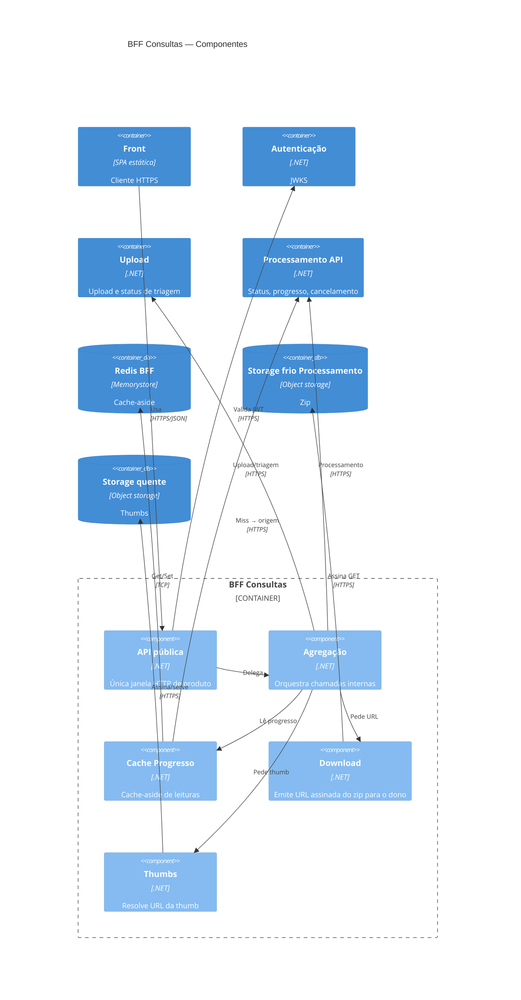

```mermaid
C4Component
  title BFF Consultas — Componentes

  Container(web, "Front", "SPA estática", "Cliente HTTPS")
  Container(auth, "Autenticação", ".NET", "JWKS")
  Container(upload, "Upload", ".NET", "Upload e status de triagem")
  Container(procApi, "Processamento API", ".NET", "Status, progresso, cancelamento")
  ContainerDb(redis, "Redis BFF", "Memorystore", "Cache-aside")
  ContainerDb(frioProc, "Storage frio Processamento", "Object storage", "Zip")
  ContainerDb(quente, "Storage quente", "Object storage", "Thumbs")

  Container_Boundary(bff, "BFF Consultas") {
    Component(gateway, "API pública", ".NET", "Única janela HTTP de produto")
    Component(agg, "Agregação", ".NET", "Orquestra chamadas internas")
    Component(cache, "Cache Progresso", ".NET", "Cache-aside de leituras")
    Component(download, "Download", ".NET", "Emite URL assinada do zip para o dono")
    Component(thumbs, "Thumbs", ".NET", "Resolve URL da thumb")
  }

  Rel(web, gateway, "Usa", "HTTPS/JSON")
  Rel(gateway, auth, "Valida JWT", "HTTPS")
  Rel(gateway, agg, "Delega")
  Rel(agg, upload, "Upload/triagem", "HTTPS")
  Rel(agg, procApi, "Processamento", "HTTPS")
  Rel(agg, cache, "Lê progresso")
  Rel(cache, redis, "Get/Set", "TCP")
  Rel(cache, procApi, "Miss → origem", "HTTPS")
  Rel(agg, download, "Pede URL")
  Rel(download, frioProc, "Assina GET", "HTTPS")
  Rel(agg, thumbs, "Pede thumb")
  Rel(thumbs, quente, "Assina/serve", "HTTPS")
```
