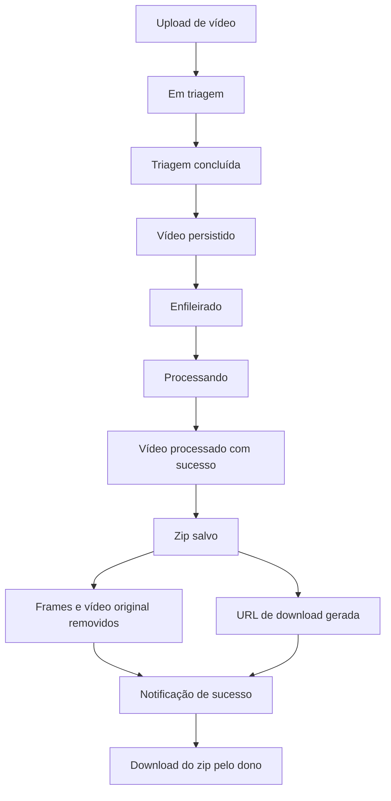

```mermaid
flowchart TD
  A[Upload de vídeo] --> B[Em triagem]
  B --> C[Triagem concluída]
  C --> D[Vídeo persistido]
  D --> E[Enfileirado]
  E --> F[Processando]
  F --> G[Vídeo processado com sucesso]
  G --> H[Zip salvo]
  H --> I[Frames e vídeo original removidos]
  H --> J[URL de download gerada]
  I --> K[Notificação de sucesso]
  J --> K
  K --> L[Download do zip pelo dono]
```
