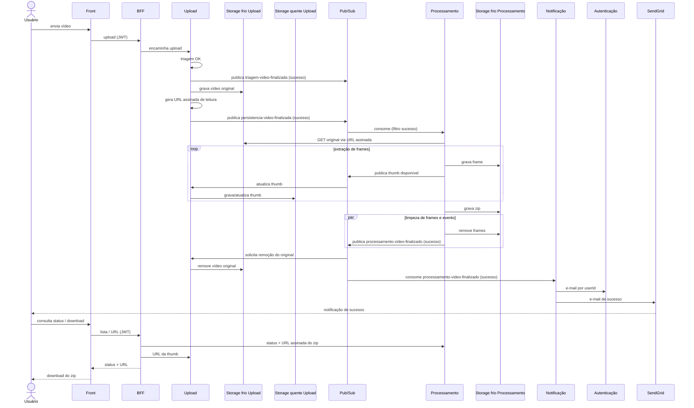

```mermaid
sequenceDiagram
  actor U as Usuário
  participant Web as Front
  participant BFF as BFF
  participant Up as Upload
  participant FrioUp as Storage frio Upload
  participant Quente as Storage quente Upload
  participant Bus as Pub/Sub
  participant Proc as Processamento
  participant FrioProc as Storage frio Processamento
  participant Notif as Notificação
  participant Auth as Autenticação
  participant SG as SendGrid

  U->>Web: envia vídeo
  Web->>BFF: upload (JWT)
  BFF->>Up: encaminha upload
  Up->>Up: triagem OK
  Up->>Bus: publica triagem-video-finalizada (sucesso)
  Up->>FrioUp: grava vídeo original
  Up->>Up: gera URL assinada de leitura
  Up->>Bus: publica persistencia-video-finalizada (sucesso)
  Bus->>Proc: consome (filtro sucesso)
  Proc->>FrioUp: GET original via URL assinada
  loop extração de frames
    Proc->>FrioProc: grava frame
    Proc->>Bus: publica thumb disponível
    Bus->>Up: atualiza thumb
    Up->>Quente: grava/atualiza thumb
  end
  Proc->>FrioProc: grava zip
  par limpeza de frames e evento
    Proc->>FrioProc: remove frames
    Proc->>Bus: publica processamento-video-finalizado (sucesso)
  end
  Bus->>Up: solicita remoção do original
  Up->>FrioUp: remove vídeo original
  Bus->>Notif: consome processamento-video-finalizado (sucesso)
  Notif->>Auth: e-mail por userId
  Notif->>SG: e-mail de sucesso
  SG-->>U: notificação de sucesso
  U->>Web: consulta status / download
  Web->>BFF: lista / URL (JWT)
  BFF->>Proc: status + URL assinada do zip
  BFF->>Up: URL da thumb
  BFF-->>Web: status + URL
  Web-->>U: download do zip
```
