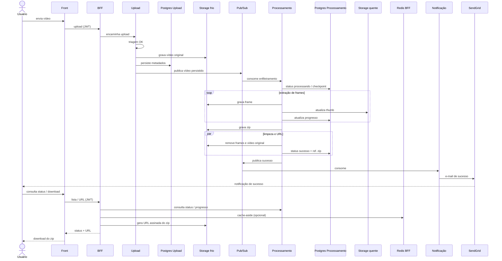

```mermaid
sequenceDiagram
  actor U as Usuário
  participant Web as Front
  participant BFF as BFF
  participant Up as Upload
  participant PGU as Postgres Upload
  participant Frio as Storage frio
  participant Bus as Pub/Sub
  participant Proc as Processamento
  participant PGP as Postgres Processamento
  participant Quente as Storage quente
  participant Redis as Redis BFF
  participant Notif as Notificação
  participant SG as SendGrid

  U->>Web: envia vídeo
  Web->>BFF: upload (JWT)
  BFF->>Up: encaminha upload
  Up->>Up: triagem OK
  Up->>Frio: grava vídeo original
  Up->>PGU: persiste metadados
  Up->>Bus: publica vídeo persistido
  Bus->>Proc: consome enfileiramento
  Proc->>PGP: status processando / checkpoint
  loop extração de frames
    Proc->>Frio: grava frame
    Proc->>Quente: atualiza thumb
    Proc->>PGP: atualiza progresso
  end
  Proc->>Frio: grava zip
  par limpeza e URL
    Proc->>Frio: remove frames e vídeo original
    Proc->>PGP: status sucesso + ref. zip
  end
  Proc->>Bus: publica sucesso
  Bus->>Notif: consome
  Notif->>SG: e-mail de sucesso
  SG-->>U: notificação de sucesso
  U->>Web: consulta status / download
  Web->>BFF: lista / URL (JWT)
  BFF->>Proc: consulta status / progresso
  BFF->>Redis: cache-aside (opcional)
  BFF->>Frio: gera URL assinada do zip
  BFF-->>Web: status + URL
  Web-->>U: download do zip
```
