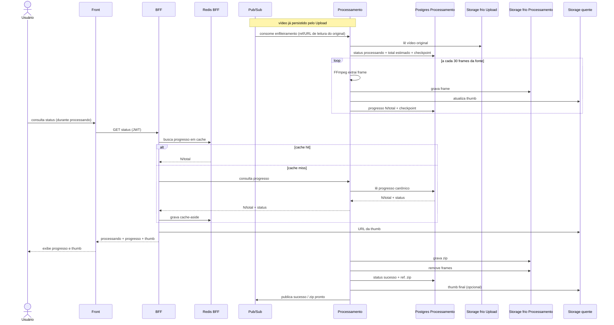

```mermaid
sequenceDiagram
  actor U as Usuário
  participant Web as Front
  participant BFF as BFF
  participant Redis as Redis BFF
  participant Bus as Pub/Sub
  participant Proc as Processamento
  participant PGP as Postgres Processamento
  participant FrioUp as Storage frio Upload
  participant FrioProc as Storage frio Processamento
  participant Quente as Storage quente

  Note over Bus,Proc: vídeo já persistido pelo Upload
  Bus->>Proc: consome enfileiramento (ref/URL de leitura do original)
  Proc->>FrioUp: lê vídeo original
  Proc->>PGP: status processando + total estimado + checkpoint

  loop a cada 30 frames da fonte
    Proc->>Proc: FFmpeg extrai frame
    Proc->>FrioProc: grava frame
    Proc->>Quente: atualiza thumb
    Proc->>PGP: progresso N/total + checkpoint
  end

  U->>Web: consulta status (durante processando)
  Web->>BFF: GET status (JWT)
  BFF->>Redis: busca progresso em cache
  alt cache hit
    Redis-->>BFF: N/total
  else cache miss
    BFF->>Proc: consulta progresso
    Proc->>PGP: lê progresso canônico
    PGP-->>Proc: N/total + status
    Proc-->>BFF: N/total + status
    BFF->>Redis: grava cache-aside
  end
  BFF->>Quente: URL da thumb
  BFF-->>Web: processando + progresso + thumb
  Web-->>U: exibe progresso e thumb

  Proc->>FrioProc: grava zip
  Proc->>FrioProc: remove frames
  Proc->>PGP: status sucesso + ref. zip
  Proc->>Quente: thumb final (opcional)
  Proc->>Bus: publica sucesso / zip pronto
```
