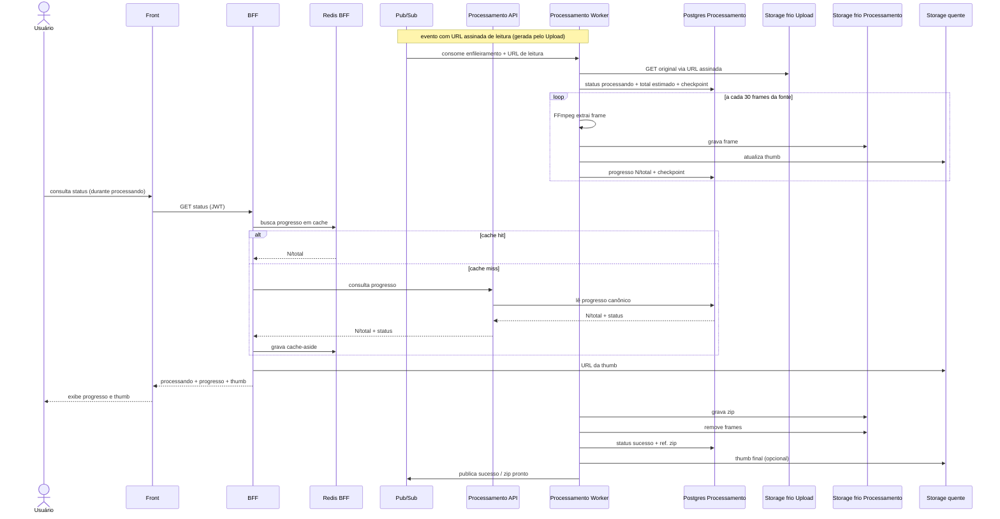

```mermaid
sequenceDiagram
  actor U as Usuário
  participant Web as Front
  participant BFF as BFF
  participant Redis as Redis BFF
  participant Bus as Pub/Sub
  participant Api as Processamento API
  participant Worker as Processamento Worker
  participant PGP as Postgres Processamento
  participant FrioUp as Storage frio Upload
  participant FrioProc as Storage frio Processamento
  participant Quente as Storage quente

  Note over Bus,Worker: evento com URL assinada de leitura (gerada pelo Upload)
  Bus->>Worker: consome enfileiramento + URL de leitura
  Worker->>FrioUp: GET original via URL assinada
  Worker->>PGP: status processando + total estimado + checkpoint

  loop a cada 30 frames da fonte
    Worker->>Worker: FFmpeg extrai frame
    Worker->>FrioProc: grava frame
    Worker->>Quente: atualiza thumb
    Worker->>PGP: progresso N/total + checkpoint
  end

  U->>Web: consulta status (durante processando)
  Web->>BFF: GET status (JWT)
  BFF->>Redis: busca progresso em cache
  alt cache hit
    Redis-->>BFF: N/total
  else cache miss
    BFF->>Api: consulta progresso
    Api->>PGP: lê progresso canônico
    PGP-->>Api: N/total + status
    Api-->>BFF: N/total + status
    BFF->>Redis: grava cache-aside
  end
  BFF->>Quente: URL da thumb
  BFF-->>Web: processando + progresso + thumb
  Web-->>U: exibe progresso e thumb

  Worker->>FrioProc: grava zip
  Worker->>FrioProc: remove frames
  Worker->>PGP: status sucesso + ref. zip
  Worker->>Quente: thumb final (opcional)
  Worker->>Bus: publica sucesso / zip pronto
```
