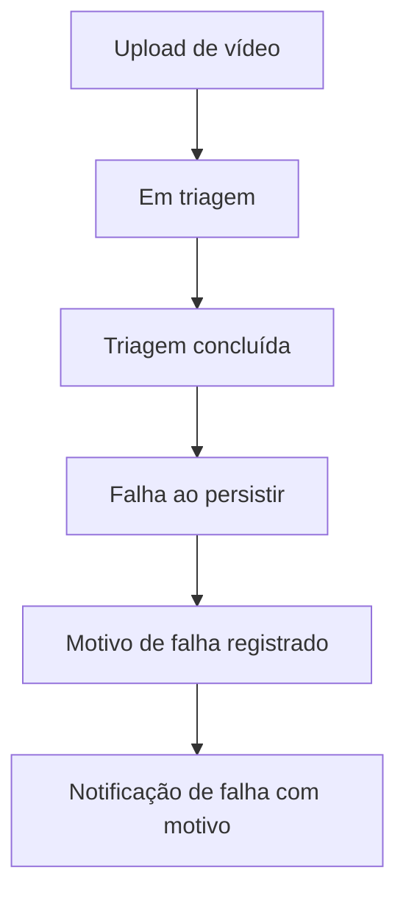

```mermaid
flowchart TD
  A[Upload de vídeo] --> B[Em triagem]
  B --> C[Triagem concluída]
  C --> D[Falha ao persistir]
  D --> E[Motivo de falha registrado]
  E --> F[Notificação de falha com motivo]
```
