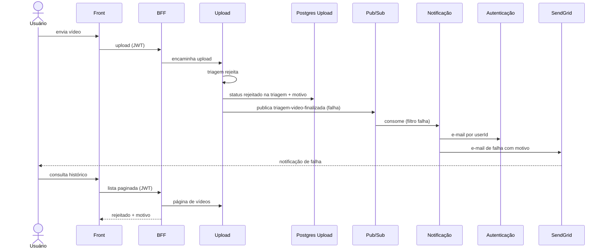

```mermaid
sequenceDiagram
  actor U as Usuário
  participant Web as Front
  participant BFF as BFF
  participant Up as Upload
  participant PGU as Postgres Upload
  participant Bus as Pub/Sub
  participant Notif as Notificação
  participant Auth as Autenticação
  participant SG as SendGrid

  U->>Web: envia vídeo
  Web->>BFF: upload (JWT)
  BFF->>Up: encaminha upload
  Up->>Up: triagem rejeita
  Up->>PGU: status rejeitado na triagem + motivo
  Up->>Bus: publica triagem-video-finalizada (falha)
  Bus->>Notif: consome (filtro falha)
  Notif->>Auth: e-mail por userId
  Notif->>SG: e-mail de falha com motivo
  SG-->>U: notificação de falha
  U->>Web: consulta histórico
  Web->>BFF: lista paginada (JWT)
  BFF->>Up: página de vídeos
  BFF-->>Web: rejeitado + motivo
```
