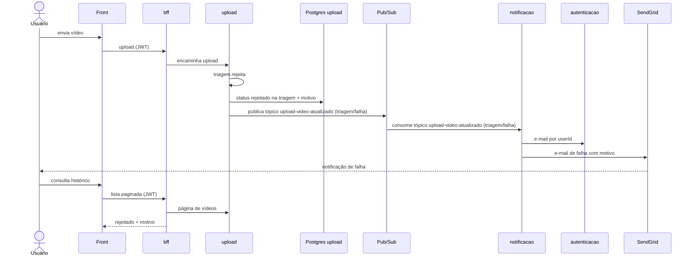

```mermaid
sequenceDiagram
  actor U as Usuário
  participant Web as Front
  participant Bff as bff
  participant Up as upload
  participant PGU as Postgres upload
  participant Bus as Pub/Sub
  participant Notif as notificacao
  participant Auth as autenticacao
  participant SG as SendGrid

  U->>Web: envia vídeo
  Web->>Bff: upload (JWT)
  Bff->>Up: encaminha upload
  Up->>Up: triagem rejeita
  Up->>PGU: status rejeitado na triagem + motivo
  Up->>Bus: publica tópico upload-video-atualizado (triagem/falha)
  Bus->>Notif: consome tópico upload-video-atualizado (triagem/falha)
  Notif->>Auth: e-mail por userId
  Notif->>SG: e-mail de falha com motivo
  SG-->>U: notificação de falha
  U->>Web: consulta histórico
  Web->>Bff: lista paginada (JWT)
  Bff->>Up: página de vídeos
  Bff-->>Web: rejeitado + motivo
```
