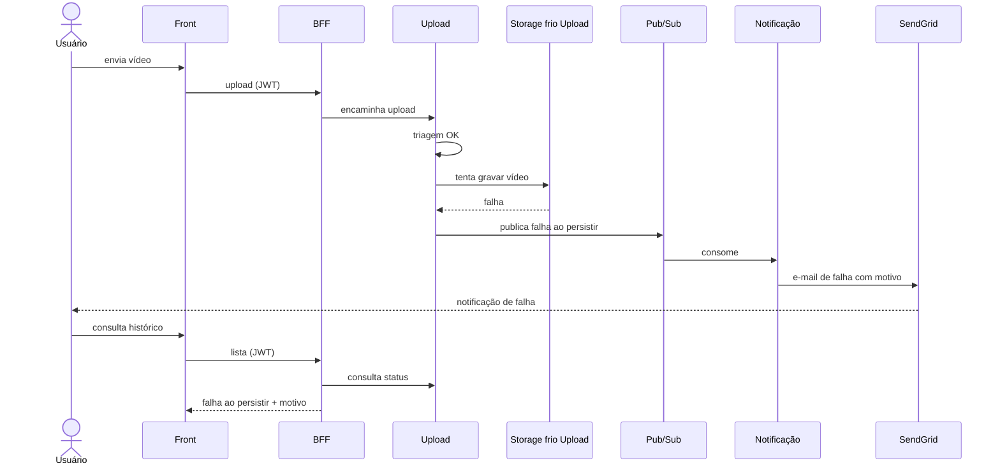

```mermaid
sequenceDiagram
  actor U as Usuário
  participant Web as Front
  participant BFF as BFF
  participant Up as Upload
  participant FrioUp as Storage frio Upload
  participant Bus as Pub/Sub
  participant Notif as Notificação
  participant SG as SendGrid

  U->>Web: envia vídeo
  Web->>BFF: upload (JWT)
  BFF->>Up: encaminha upload
  Up->>Up: triagem OK
  Up->>FrioUp: tenta gravar vídeo
  FrioUp-->>Up: falha
  Up->>Bus: publica falha ao persistir
  Bus->>Notif: consome
  Notif->>SG: e-mail de falha com motivo
  SG-->>U: notificação de falha
  U->>Web: consulta histórico
  Web->>BFF: lista (JWT)
  BFF->>Up: consulta status
  BFF-->>Web: falha ao persistir + motivo
```
