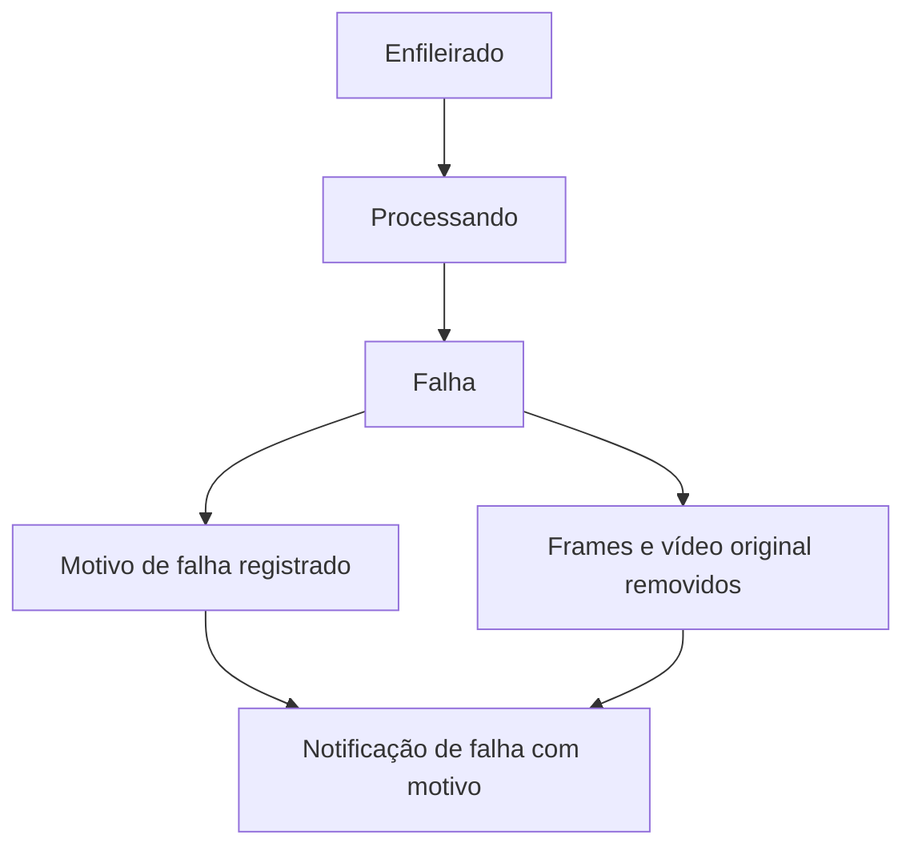

```mermaid
flowchart TD
  A[Enfileirado] --> B[Processando]
  B --> C[Falha]
  C --> D[Motivo de falha registrado]
  C --> E[Frames e vídeo original removidos]
  D --> F[Notificação de falha com motivo]
  E --> F
```
