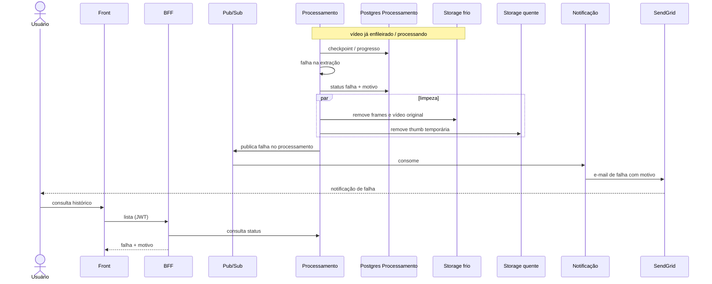

```mermaid
sequenceDiagram
  actor U as Usuário
  participant Web as Front
  participant BFF as BFF
  participant Bus as Pub/Sub
  participant Proc as Processamento
  participant PGP as Postgres Processamento
  participant Frio as Storage frio
  participant Quente as Storage quente
  participant Notif as Notificação
  participant SG as SendGrid

  Note over Proc,Frio: vídeo já enfileirado / processando
  Proc->>PGP: checkpoint / progresso
  Proc->>Proc: falha na extração
  Proc->>PGP: status falha + motivo
  par limpeza
    Proc->>Frio: remove frames e vídeo original
    Proc->>Quente: remove thumb temporária
  end
  Proc->>Bus: publica falha no processamento
  Bus->>Notif: consome
  Notif->>SG: e-mail de falha com motivo
  SG-->>U: notificação de falha
  U->>Web: consulta histórico
  Web->>BFF: lista (JWT)
  BFF->>Proc: consulta status
  BFF-->>Web: falha + motivo
```
