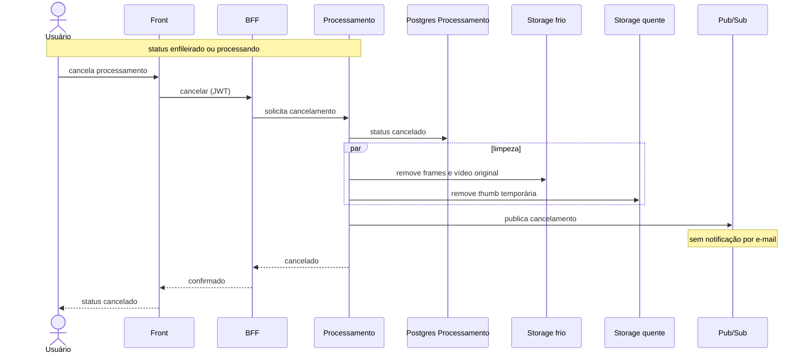

```mermaid
sequenceDiagram
  actor U as Usuário
  participant Web as Front
  participant BFF as BFF
  participant Proc as Processamento
  participant PGP as Postgres Processamento
  participant Frio as Storage frio
  participant Quente as Storage quente
  participant Bus as Pub/Sub

  Note over U,Proc: status enfileirado ou processando
  U->>Web: cancela processamento
  Web->>BFF: cancelar (JWT)
  BFF->>Proc: solicita cancelamento
  Proc->>PGP: status cancelado
  par limpeza
    Proc->>Frio: remove frames e vídeo original
    Proc->>Quente: remove thumb temporária
  end
  Proc->>Bus: publica cancelamento
  Note over Bus: sem notificação por e-mail
  Proc-->>BFF: cancelado
  BFF-->>Web: confirmado
  Web-->>U: status cancelado
```
