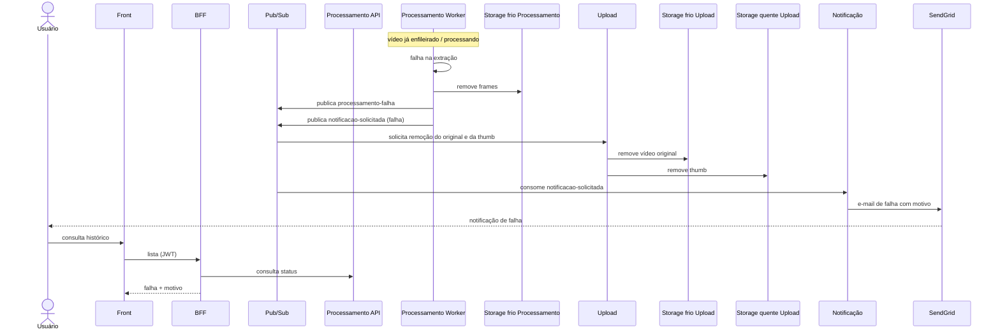

```mermaid
sequenceDiagram
  actor U as Usuário
  participant Web as Front
  participant BFF as BFF
  participant Bus as Pub/Sub
  participant Api as Processamento API
  participant Worker as Processamento Worker
  participant FrioProc as Storage frio Processamento
  participant Up as Upload
  participant FrioUp as Storage frio Upload
  participant Quente as Storage quente Upload
  participant Notif as Notificação
  participant SG as SendGrid

  Note over Worker: vídeo já enfileirado / processando
  Worker->>Worker: falha na extração
  Worker->>FrioProc: remove frames
  Worker->>Bus: publica processamento-falha
  Worker->>Bus: publica notificacao-solicitada (falha)
  Bus->>Up: solicita remoção do original e da thumb
  Up->>FrioUp: remove vídeo original
  Up->>Quente: remove thumb
  Bus->>Notif: consome notificacao-solicitada
  Notif->>SG: e-mail de falha com motivo
  SG-->>U: notificação de falha
  U->>Web: consulta histórico
  Web->>BFF: lista (JWT)
  BFF->>Api: consulta status
  BFF-->>Web: falha + motivo
```
