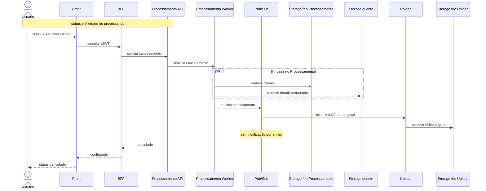

```mermaid
sequenceDiagram
  actor U as Usuário
  participant Web as Front
  participant BFF as BFF
  participant Api as Processamento API
  participant Worker as Processamento Worker
  participant Bus as Pub/Sub
  participant FrioProc as Storage frio Processamento
  participant Quente as Storage quente
  participant Up as Upload
  participant FrioUp as Storage frio Upload

  Note over U,Api: status enfileirado ou processando
  U->>Web: cancela processamento
  Web->>BFF: cancelar (JWT)
  BFF->>Api: solicita cancelamento
  Api->>Worker: sinaliza cancelamento
  par limpeza no Processamento
    Worker->>FrioProc: remove frames
    Worker->>Quente: remove thumb temporária
  end
  Worker->>Bus: publica cancelamento
  Bus->>Up: solicita remoção do original
  Up->>FrioUp: remove vídeo original
  Note over Bus: sem notificação por e-mail
  Api-->>BFF: cancelado
  BFF-->>Web: confirmado
  Web-->>U: status cancelado
```
