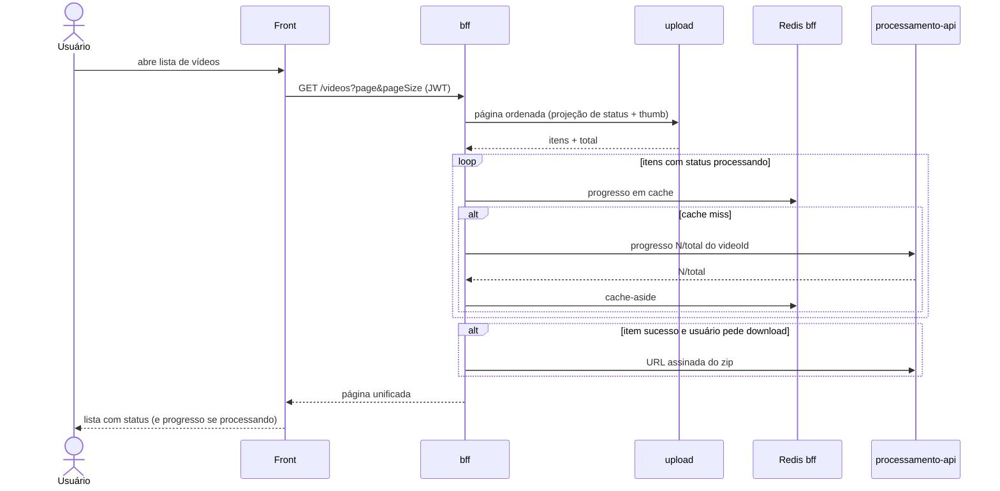

```mermaid
sequenceDiagram
  actor U as Usuário
  participant Web as Front
  participant Bff as bff
  participant Up as upload
  participant Redis as Redis bff
  participant ProcApi as processamento-api

  U->>Web: abre lista de vídeos
  Web->>Bff: GET /videos?page&pageSize (JWT)
  Bff->>Up: página ordenada (projeção de status + thumb)
  Up-->>Bff: itens + total
  loop itens com status processando
    Bff->>Redis: progresso em cache
    alt cache miss
      Bff->>ProcApi: progresso N/total do videoId
      ProcApi-->>Bff: N/total
      Bff->>Redis: cache-aside
    end
  end
  alt item sucesso e usuário pede download
    Bff->>ProcApi: URL assinada do zip
  end
  Bff-->>Web: página unificada
  Web-->>U: lista com status (e progresso se processando)
```
