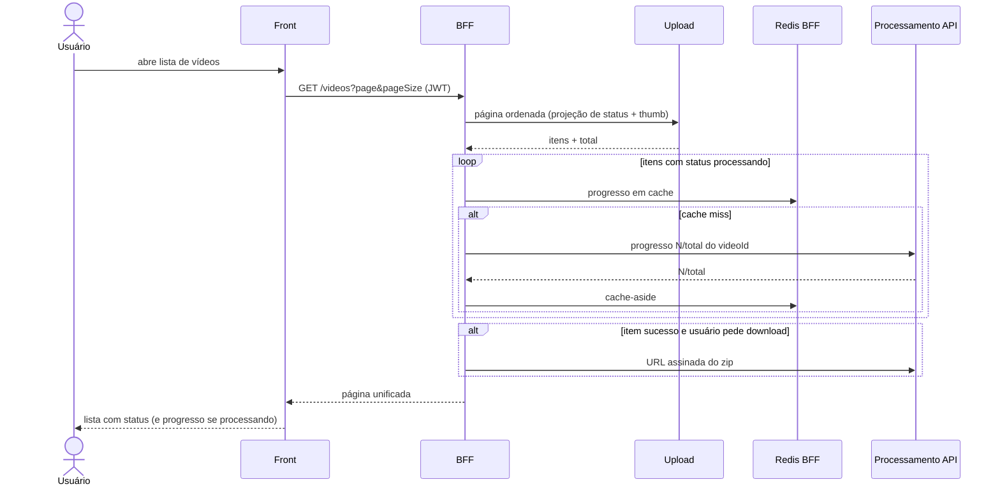

```mermaid
sequenceDiagram
  actor U as Usuário
  participant Web as Front
  participant BFF as BFF
  participant Up as Upload
  participant Redis as Redis BFF
  participant Api as Processamento API

  U->>Web: abre lista de vídeos
  Web->>BFF: GET /videos?page&pageSize (JWT)
  BFF->>Up: página ordenada (projeção de status + thumb)
  Up-->>BFF: itens + total
  loop itens com status processando
    BFF->>Redis: progresso em cache
    alt cache miss
      BFF->>Api: progresso N/total do videoId
      Api-->>BFF: N/total
      BFF->>Redis: cache-aside
    end
  end
  alt item sucesso e usuário pede download
    BFF->>Api: URL assinada do zip
  end
  BFF-->>Web: página unificada
  Web-->>U: lista com status (e progresso se processando)
```
